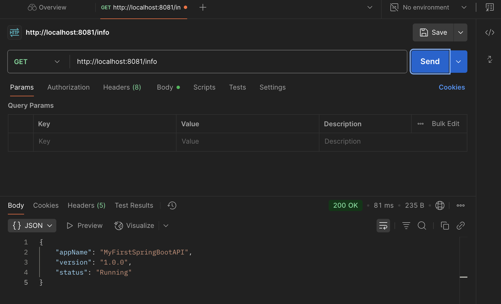

# Spring Boot Challenges
Submitted by: Baruc, Jana Enigma S.

## SESSION 1
### Challenge Lab 1
Customizing Server & Application Properties

### Challenge Lab 2
Dynamic Endpoints with Request Parameters

### Challenge Lab 3
Returning Dynamic JSON Responses (Maps & Lists)

### Lab 6
Define Your REST API Endpoints

| Resource      |HTTP Verb| Resource URL                           |Use Case Representation      |
|---------------|---------|----------------------------------------|-----------------------------|
| Visitor       |GET      | /visitors/1                            |Get information about Visitor|
| Ticket Shop   |POST     | zoos/1/ticket-shop/tickets             |Visitor buys a Ticket        |
| Ticket        |GET      | /visitors/1/tickets/1                  |Visitor shows Valid Ticket   |
| Zoo Entry     |POST     | /zoos/1/entries                        |Visitor enters the Zoo       |
| Enclosure Visit |POST     | /zoos/1/visitors/1/enclosures/1/visits |Visitor visits Enclosure     |
| Animal Feed   |POST     | /zoos/1/enclosures/1/animals/1/feeds   |Visitor feeds an Animal      |
| Shop Visit    |POST     | /zoos/1/visitors/1/shops/1/visits      |Visitor visits Shop          |
| Shop Purchase |POST     | /zoos/1/shops/1/purchases              |Visitor makes a Purchase     |
| Hospital Visit |POST     | /zoos/1/visitors/1/hospital/visits     |Visitor visits Hospital      |
| Lecture Listening |POST     | /zoos/1/hospital/lectures/1/listens    |Visitor listens to a Lecture |
| Zoo Exit      |POST     | /zoos/1/exits                          |Visitor exits the Zoo        |

## SESSION 2
### Lab 8
Create GET All Products Endpoint

### Lab 9
Create GET Product by ID Endpoint

### Lab 10
Create POST Product Endpoint

